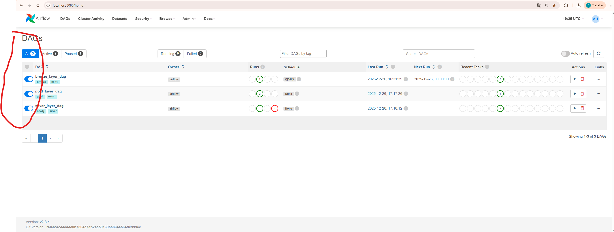

## comando para converter entrypoint para unix
dos2unix entrypoint.sh

## comando para executar os testes
 tests/run_tests.sh all
 tests/run_tests.sh integration

## 📊 Data Engineer Code Challenge
ClinicalTrials.gov → Neo4j Knowledge Graph

This project implements a complete end-to-end data pipeline that ingests public data from ClinicalTrials.gov, transforms it into structured entities, and loads everything into a Neo4j graph database.

The main goal is to demonstrate how to build a Knowledge Graph that connects:

- Clinical trials
- Drugs
- Companies / Organizations (Sponsors and Collaborators)
- Diseases / Conditions
- Route of administration
- Dosage form

The entire pipeline is automated, re-runnable, and runs locally using Docker, without requiring manual database setup.

## 🧰 Technologies Used

- Neo4j – Graph database
- Python – Data ingestion and transformation scripts
- Apache Airflow – Pipeline orchestration (controls execution order)
- Docker & Docker Compose – Run everything locally with minimal setup
- APOC – Neo4j library for high-performance batch loading

## Prerequisites

Before start, you will need docker installed on your computer:

- [Docker](https://docs.docker.com/get-docker/)

## Requisites

- neo4j
- psycopg2-binary
- pandas

## Steps

- Clone the repository to your local machine.

```
git clone git@github.com:descomplicandodados/neo4j.git
```

- Open de project folder

```
cd neo4j
```

- Download data from [Clinical-Trials](https://ctti-aact.nyc3.digitaloceanspaces.com/6scsc1rzihfyr5gdh3fxglrs8sro)
- Extract data from zip/rar, copy all txt files and past on neo4j/bases_neo4j folder

- Execute the commands:
```
docker build -t neo4j .
```

```
docker run --rm neo4j
```

- Wait 1 minute or a little bit more to neo4j and airflow starts to working

## Run this commands to execute the tests
```
 tests/run_tests.sh all
 ```
 ```
 tests/run_tests.sh integration
 ```

## Airflow
- Use this address [Airflow](http://localhost:8080/) to access airflow, use de user:admin and password:admin, both can be changed on .env file. On Airflow you will active this 3 dags.


You will wait until de Runs column status be "sucess"